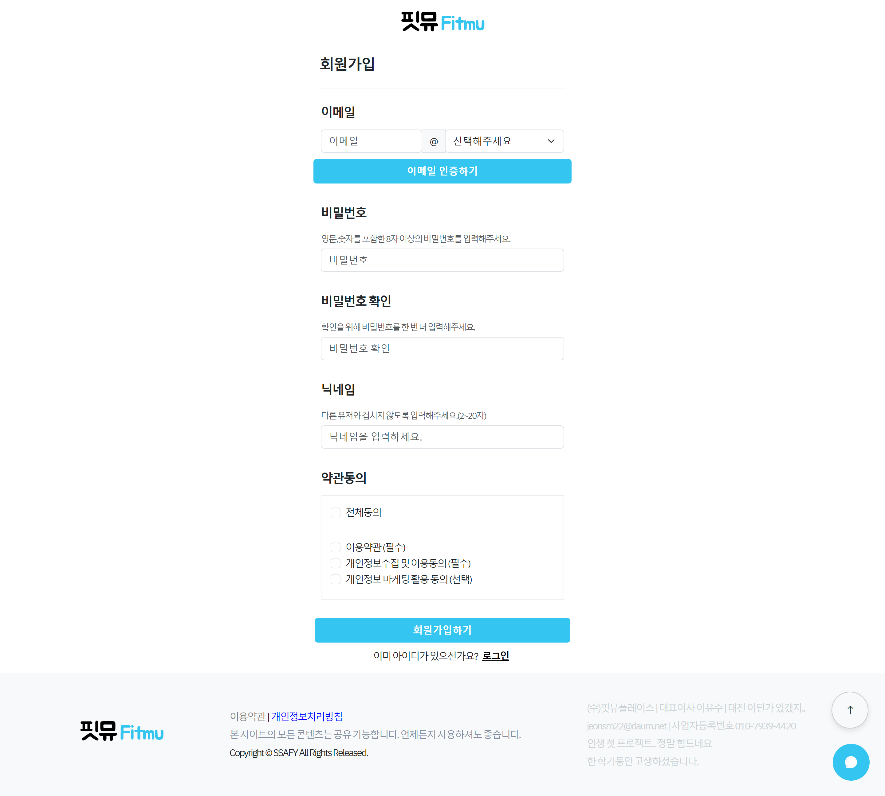
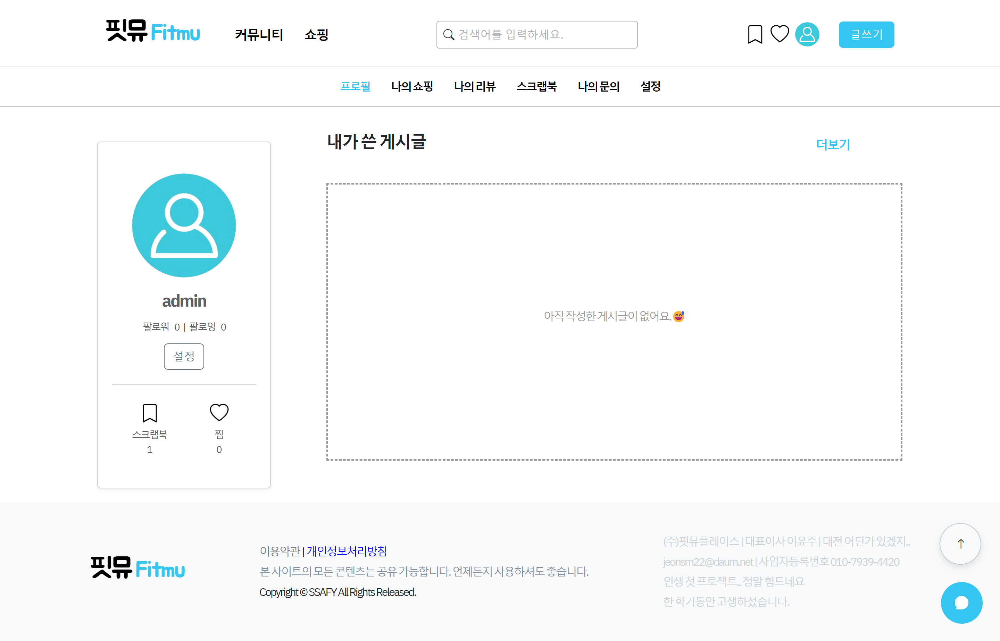

# Fitmu (쇼핑과 커뮤니티를 하나로!)

지금까지 이런 사이트는 없었다!! 커뮤니티를 즐기면서 쇼핑까지! 실 사용자들의 생각과 경험을 보면서 나에게 필요한 상품은 바로바로 구입할 수 있는 Fitmu 사이트입니다.

## 목차

- [개요](#개요)
- [상세 화면](#상세-화면)
- [주요 기능](#주요-기능)
- [프로젝트 도중 만난 문제들](#만난-문제-및-느낀점)

---

## 개요

---

- 프로젝트 이름 : Fitmu
- 프로젝트 기간 : 2024.05.03-2024.05.24 (3주)
- STACK

  > **Front-End** :
  >     

  > **Back-End** :
  >    Java..

  > **Database** :
  > 

  > **Communication** :
  >  

  > **Environment** :
  >   

- 멤버 : 전성모(<https://github.com/jeonsm22>), 이윤주(<https://github.com/yujachaa>)

---

## 상세 화면

---

### 1. 커뮤니티 메인화면

## 

### 2. 쇼핑 메인화면

## 

### 3. 로그인 화면

## 

### 4. 회원가입 화면

## 

### 5. 마이페이지 화면

## 

### 6. 게시글 상세화면

## 

### 7. 상품 상세화면

## 

### 8. 상품 등록화면

## 

### 9. 주문 화면

## 

### 10. 검색 화면

<!-- > 사진이 너무 커서 다운받아서 보시면 될 것 같습니다. 죄송합니다! -->

---

## 주요 기능

---

- 상품관련

  > 1. 상품 등록 기능
  > 2. 상품 주문 기능 (배송지 관리 기능(기본 배송지 지정 가능), DAUM POSTCODE)
  > 3. 문의 기능
  > 4. 리뷰 기능
  > 5. 좋아요 기능

- 게시글관련

  > 1. 게시글 등록 기능
  > 2. 상품 태그 기능
  > 3. 댓글 기능
  > 4. 스크랩 기능

- 유저관련

  > 1. 팔로우 기능
  > 2. 로그인(일반 로그인, 카카오 로그인), 회원가입
  > 3. 정보 변경 기능

- 기타
  > 1. 검색 기능( 검색 정렬 변경 가능 )
  > 2. 판매자 등록 기능
  > 3. 고객센터(Chat GPT 활용 챗봇)
  > 4. 맨 위로 자동 스크롤 버튼
  > 5. 댓글이 있는 위치 스크롤 버튼

---

## 만난 문제 및 느낀점

---

> 1. 카카오 로그인 구현 시 CORS 오류
>    > 프론트에서 인가토큰값을 요청 후 리다이렉트를 서버로 받으면 CORS 오류가 발생.
>    > 그래서 인가토큰값을 프론트에서 먼저 받고 그 값을 서버에 전달하는 식으로 해결.

> 2. 변수의 값이 초기화 되기 전에 렌더링이 되어 오류가 발생하는 문제.
>    > computed 함수를 통해 변수의 값을 바로바로 받으면 오류 해결.

> 3. DB의 기초가 튼튼해야 한다.
>    > DB가 허술하면 프로젝트를 진행할 수록 했던 일을 해야하고 특히 참조키는 꼭 필요한 경우에만!

> 4. 매우 매우 많은 문제들을 만났었지만 첫 프로젝트라 정리할 정신이 없었다. 다음에는 꼭 사소한거라도 하나하나 정리하면서 프로젝트를 진행하자.
